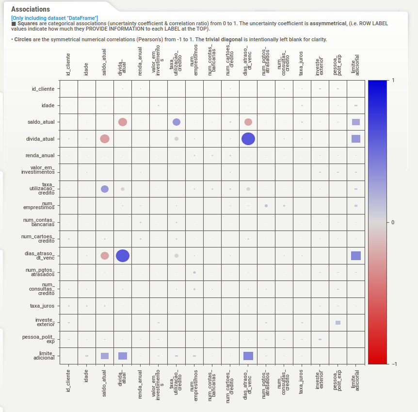
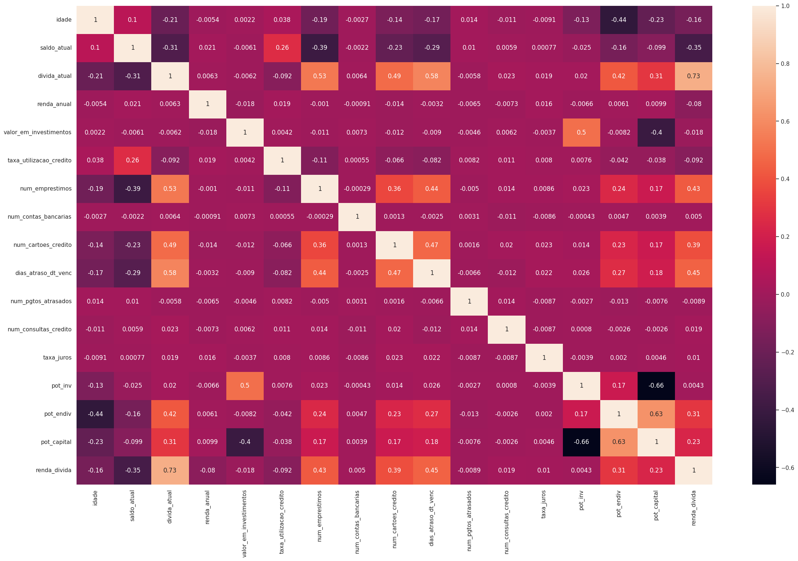

 <h1 align="center"> "Billion Bank Credit Analysis" </h1>

# Sejam bem-vindos ao meu projeto de portfólio da competição de dados da Comunidade DS: "Billion Bank"

## 1.0 Contexto do Negócio

O Billion Bank é um banco digital brasileiro, fundado em 2021. Trabalha hoje com contas digitais, e cartões de crédito.

Quando um cliente solicita aumento de limite no cartão de crédito, o banco consulta uma empresa de crédito terceira, que retorna uma recomendação: "negar" ou "conceder". Essa resposta é repassada ao cliente.

Dado que a empresa de crédito precisa levantar maiores informações de histórico financeiro do cliente com terceiros, o retorno da recomendação ao banco leva até 5 dias úteis!

Tratando-se de um serviço, a cada solicitação de aumento de limite feita por um cliente, o banco tem um custo adicional de consulta. Visando reduzir este custo, em 2022, o banco passou a só aceitar novos pedidos de aumento de limite a cada 3 meses.

O banco viu um aumento leve do churn no primeiro semestre, que se acentuou mais no segundo, chegando a um ponto já preocupante. O time de CS fez contato com antigos clientes, e constatou que o principal motivo do churn foi a percepção de burocracia relacionada ao aumento nos limites.

Para reverter o cenário, o banco traçou um plano de ação com dois objetivos:
1 - Desburocratizar o processo, permitindo que o cliente possa solicitar um novo limite uma vez por semana, tendo uma resposta instantânea.
2 - Desativar as consultas de recomendação de aumento de limites feitas hoje com a empresa terceira, que são demoradas e custosas.

Para concretizar o plano, foi solicitado ao time de cientistas de dados, que com base no histórico de recomendações ("negar" ou "conceder") da empresa de crédito, aliado ao histórico financeiro dos clientes, desenvolvam um modelo de avaliação de aumento de limite de cartão de crédito dentro de casa.

O modelo de classificação, deve informar se o Billion Bank deve "negar" ou "conceder" o aumento no limite solicitado pelo cliente.

**Fonte:** [ Kaggle ](https://www.kaggle.com/competitions/cdshackdays3)

## 2.0 Planejamento prévio

* Nesta competição os alunos da Comunidade DS foram divididos em Squad's com 4 estudantes cada. Ao todo tivemos 24 Squad's e mais de 90 participantes ao todo.
* O meu Squad teve a seguinte formação:

### O método CRISP-DS foi utilizado como base para o desenvolvimento deste projeto

### 2.1 Ferramentas, IDE's e Bibliotecas

* Python 3.09
* Visual Studio Code
* Jupyter Notebook
* Deepnote
* Bibliotecas: Seaborn, Pandas, Numpy, Inflection, Scipy, XGBoost, SKLearn, Category Encoders e LightGBM

### 2.2 Produto final

* O produto final será a recomendação que o time de cientistas de dados irá apontar. Serão atribuídos os valores "negar" ou "conceder" de acordo com a análise e a aplicação dos modelos de Aprendizado de Máquina. Sendo assim, o resultado final será apresentado de maneira precisa e rápida, agilizando toda a rotina de análise de crédito do banco.

## 3.0 Dados

##### Estes dados são públicos e foram baixados na página web do [Kaggle](https://www.kaggle.com/competitions/cdshackdays3).

### 3.1 Atributos de origem
|**Atributos**               |  **Tipo**  |  **Descrição**                                                              |
| ---------------------------|------------|-----------------------------------------------------------------------------|
|id_cliente                  |   int64    | Número único de registro dos clientes                                       |
|idade                       |   int64    | Idade do cliente                                                            |
|saldo_atual                 |   float64  | Saldo atual da conta do cliente                                             |
|divida_atual                |   float64  | Valor atual da dívida do cliente                                            |
|renda_anual                 |   float64  | Renda total anual do cliente                                                |
|valor_em_investimentos      |   float64  | Valor total em investimentos                                                |
|taxa_utilizacao_credito     |   float64  | Limite utilizado do cartão de crédito                                       |
|num_emprestimos             |   int64    | Quantidade de empréstimos do cliente                                        | 
|num_contas_bancarias        |   int64    | Quantidade de contas bancárias do cliente                                   |
|num_cartoes_credito         |   int64    | Quantidade de cartões de crédito do cliente                                 |
|dias_atraso_dt_venc         |   int64    | Quantidade de dias em atraso no cartão                                      |
|num_pgtos_atrasados         |   int64    | Quantidade de parcelas de pagamentos atrasadas                              |
|num_consultas_credito       |   int64    | Quantidade de consultas para crédito                                        |
|taxa_juros                  |   int64    | Valor da taxa de juros                                                      |
|investe_exterior            |   object   | Se o cliente tem investimento em outros países                              |
|pessoa_polit_exp            |   object   | Se o cliente é pessoa politicamente exposta                                 |
|limite_adicional            |   object   | Se o cliente irá, ou não, obter limite adicional de crédito (variável alvo) |    

### Atributos criados

Potencial de investimento -> calculado a partir do valor de investimento dividido pela idade do cliente.
Potencial de inadimplência -> calculado a partir da dívida atual dividido pela idade do cliente.
Potencial livre para investimento -> calculado a partir da subtração do potencial de inadimplência pelo potencial de investimento.
Endividamento -> é o resultado da divisão da dívida atual pela renda atual.

## Visualização dos atributos numéricos em gráfico de barras

## Visualização da correlação dos Atributos.

## Mapa de calor da correlação dos Atributos pelo método "Pearson".

## 4.0 Modelagem dos dados

Nesta etapa, os dados foram preparados para o início das aplicações dos modelos de Machine Learning. 
Os atributos categóricos foram trasnformados utilizando o Label Encorder.
Os outliers das colunas idade, num_cartoes_credito e num_emprestimos foram substituídos pela valor da mediana.
As colunas  id_cliente e pessoa_polit_exp foram excluídas porque estavam causando ruídos nos resultados dos algoritmos de ML. 

## 5.0 Machine Learning Modeling

Nesse processo de escolha de modelos de Machine Learning, foram relizados testes e treinamentos com seis tipos de Classificadores, eles são os seguintes: Random Forest Classifier, LGBM Classifier, XGBoost Classifier, K-Nearest Neighbors e o Model C-Support Vector Classification. 
A métrica utilizada para a avalição dos algoritmos de classificação foi o F1 Score.

## Performance

## 6.0 Ensemble Learning

Aqui aplicamos a técnica de Ensemble Learning, para aplicação de tal técnica utilizamos a biblioteca 'Voting Classifier' da 'Scikit Learn'. 
Este algoritmo combina o conceito de diferentes classificadores de Machine Learning, e usa a maioria dos votos ou a média das probabilidades previstas, para assim, realizar a predição da classe alvo. Essa classificação pode se usada para alcançar uma simetria de performance no balanceamento geral dos dados. Em outras palavras, o algoritmo potencializa as vantagens de um determinado algoritmo de Machine Learning para balancear as suas fraquezas na classificação.

## Performance Final de:

# 0.928834

## 7.0 Conclusão

Após 32 horas de intensa programação durante o evento Hack Days, a fase de submissões foi encerrada e o Leaderboard foi selado. O esforço da nossa equipe culminou em uma pontuação de acurácia final de 0.88466 na classificação Privada - a métrica mais crucial nesse tipo de competição.

Garantir a 3ª posição no quadro geral de classificação solidificou nossa crença de que estávamos conduzindo nosso projeto na direção certa. As classificações finais foram determinadas nos centésimos, destacando a competição acirrada na reta final, com equipes igualmente equilibradas e dedicadas a entregar um resultado final de alta qualidade.

A equipe pyTontos dos Dados se orgulha imensamente de entregar um projeto excepcional dentro de um prazo apertado, o que merece comemorações por todos os lados. O aprendizado acumulado nesse curto período foi verdadeiramente monumental!

Estendo minha sincera gratidão aos meus incríveis colegas de equipe - Raquel, Eduardo e Fernando. Um agradecimento especial também vai para nossos mentores e para toda a Comunidade DS pelo apoio e orientação incansáveis ao longo dessa jornada!

## Leaderboard

